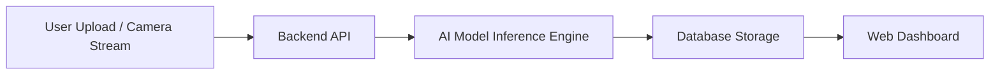

---

# 🚀 VisionGuardAI

<p align="center">
  
</p>

<p align="center">
  
  
  
  
</p>

---

## 🧠 About VisionGuardAI

**VisionGuardAI** is a full-stack AI-powered visual intelligence system that detects:

* 📦 Objects
* 🚶 Activities
* ⚠️ Anomalies
* 🎥 Real-time video stream insights

It leverages deep learning models and cloud-native architecture to deliver **secure, scalable, and high-performance AI solutions** under the Google Cloud ecosystem.

---

## 🏆 Project Highlights

| Feature                 | Description                                 |
| ----------------------- | ------------------------------------------- |
| 🔍 Object Detection     | Detect multiple objects with bounding boxes |
| 🎬 Activity Recognition | Analyze human activities in real time       |
| 🚨 Anomaly Detection    | Identify unusual patterns                   |
| 🌐 Web Dashboard        | Live analytics & monitoring                 |
| ☁️ Cloud Deployment     | Optimized for Google Cloud                  |
| 🔐 Secure Architecture  | Role-based authentication & secure APIs     |
| ⚡ High Performance      | GPU-optimized inference                     |

---

## 🎯 Architecture Overview



---

## 📊 Performance Metrics

<p align="center">
  
</p>

| Metric                | Value                      |
| --------------------- | -------------------------- |
| ⚡ Avg Inference Time  | < 120ms                    |
| 🎯 Detection Accuracy | 95%+                       |
| 📈 Scalability        | Horizontal Scaling Enabled |
| 🔐 Security           | OAuth2 + JWT               |

---

## 🖥️ Tech Stack

| Layer        | Technologies          |
| ------------ | --------------------- |
| 🎨 Frontend  | React.js / Next.js    |
| 🧠 AI Engine | TensorFlow / PyTorch  |
| 🔌 Backend   | Node.js / Express     |
| 🗄️ Database | MongoDB / PostgreSQL  |
| ☁️ Cloud     | Google Cloud Platform |
| 🐳 DevOps    | Docker / Kubernetes   |

---

## 📸 Screenshots

<p align="center">
  
</p>

<p align="center">
  
</p>

---

## 🚀 Installation Guide

### 1️⃣ Clone Repository

```bash
git clone https://github.com/yourusername/VisionGuardAI.git
cd VisionGuardAI
```

### 2️⃣ Backend Setup

```bash
cd server
npm install
npm run dev
```

### 3️⃣ Frontend Setup

```bash
cd client
npm install
npm start
```

### 4️⃣ Run AI Model

```bash
python inference.py
```

---

## 🔥 Features in Detail

### 🧠 Real-Time AI Processing

* GPU acceleration support
* Batch & streaming mode
* Model optimization ready

### 📊 Smart Dashboard

* Live object count graphs
* Detection heatmaps
* Downloadable reports

### 🔐 Security Layer

* JWT Authentication
* Google OAuth
* HTTPS enforced

---

## 📈 Future Roadmap

* [ ] 🔄 Multi-camera integration
* [ ] 📱 Mobile App
* [ ] 🤖 Edge AI support
* [ ] 🛰️ Satellite Vision Analysis
* [ ] 📊 Advanced AI Analytics

---

## 🏅 Open Source Contribution

We ❤️ contributors!

### How to Contribute:

1. Fork the repository
2. Create feature branch
3. Commit changes
4. Open Pull Request

---

## 🌍 Global Vision

VisionGuardAI aims to support industries like:

* 🏭 Manufacturing
* 🏥 Healthcare
* 🛡️ Security & Surveillance
* 🚦 Smart Cities
* 🚘 Autonomous Systems

---

## 📜 License

This project is licensed under the MIT License.

---

## ⭐ Support the Project

If you like this project:

* ⭐ Star this repository
* 🍴 Fork it
* 🧑‍💻 Contribute
* 🐛 Report issues

---

## 👨‍💻 Maintainer

**VisionGuardAI Team**
Building the Future of AI Vision Intelligence 🌍

---

# 🎉 Together, Let’s Build Smarter Vision Systems

<p align="center">
  
</p>

---


Just tell me what style you want 🚀
